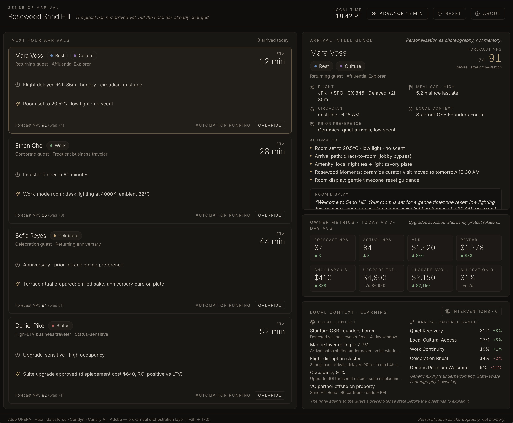

# Sense of Arrival — Rosewood Sand Hill



A hackathon MVP demonstrating **autonomous arrival orchestration** for Rosewood
Hotels. Not a staff copilot — an automated system. The front desk sees what
the system is doing and can intervene; the default mode is automation.

> "The guest has not arrived yet, but the hotel has already changed."

## Run

```bash
npm install
npm run dev
```

Then open the local URL Vite prints (usually `http://localhost:5173`). Strict
TypeScript check: `npm run typecheck`. Production build: `npm run build`.

## The four panes

1. **Next Four Arrivals** — Four upcoming guest cards. Each shows ETA, need
   state, the key trigger driving the choreography, the headline automated
   action, and the forecast NPS the hotel is shooting for. The "Override"
   button lets the front desk intervene.

2. **Arrival Intelligence** — When you click a card, this pane shows the full
   reasoning: flight status, meal gap, circadian state, body-clock
   equivalent, local context, prior preference, the full list of automated
   actions, and the in-room display copy the guest will see.

3. **Owner Metrics** — Forecast NPS, Actual NPS, ADR, RevPAR, ancillary per
   stay, upgrade cost today vs the 7-day average, and upgrade cost avoided.
   Today vs trailing 7-day deltas in green/red. Upgrades are not eliminated;
   they are allocated where they protect relationship value.

4. **Context + Learning** — Two columns plus a button: a local context radar
   (Founders Forum, weather, flight disruption clusters, occupancy, nearby
   VC offsite); a contextual-bandit view of which arrival package is currently
   winning reward; and an **Interventions · N** button that opens the override
   log.

## Simulation

Everything runs locally with synthetic data. No backend, no auth, no real
APIs. Press **Advance 15 min** (or the spacebar) to step time forward:

- ETAs decrement.
- Guests whose ETA passes zero arrive — their card flips to show Actual NPS,
  and the next guest in the queue slides into the pane.
- Owner metrics shift slightly (actual NPS converges, upgrade costs drift).
- Bandit weights re-balance toward state-aware choreography (Quiet Recovery,
  Local Cultural Access) and away from Generic Premium Welcome.

Deltas are deterministic — seeded from the offset and guest id — so each
demo plays back identically. Use **Reset** to return to the opening state.

### Keyboard

- `↑` / `↓` cycle the selected guest card
- `Space` advances time by 15 minutes

## What is mocked

Everything. None of these are real:

- Flight status, meal timing, circadian state
- PMS room state, occupancy, displacement cost
- CRM guest preferences, anniversary history
- Local context signals (Founders Forum, weather, VC offsite)
- The contextual bandit, the NPS forecaster, the upgrade ROI model

The guest cards, the bandit weights, and the metrics are all seed data living
in `src/data/`. The rule-based helpers in `src/lib/` (`meal`, `circadian`,
`nps`, `bandit`, `simulation`) stand in for what would be real services.

## What becomes real later (mapped to Rosewood's actual stack)

| Mock in this demo | Real Rosewood integration surface |
| --- | --- |
| Room state, occupancy, stay history | **Oracle OPERA** via **OHIP** or via **Hapi** event streams |
| Guest 360 / preferences / segments | **Salesforce** (Sales / Service / Marketing Cloud), fed by **Hapi** on AWS |
| Loyalty + marketing automation | **Cendyn** (and Cendyn eInsight) |
| Reservations / distribution | **Sabre Hospitality (SynXis)** |
| In-stay messaging, AI Voice, AI Webchat, check-in | **Canary Technologies** *(already deployed at Rosewood)* |
| Marketing analytics & DSP | **Adobe Analytics**, **Sojern**, **Triptease**, **Xandr**, **Microsoft Clarity** |
| Consent / privacy | **OneTrust** |
| Flight data | Cirium / FlightAware / Amadeus |
| Cloud (partner-mediated) | **AWS** (via Hapi) |
| Local events feed | Curated editorial + PredictHQ |
| NPS forecaster | Internal stay-level model trained on Salesforce + OPERA signals |
| Contextual bandit | In-house orchestration service (Vowpal Wabbit / SageMaker class) |
| Room controls | Property-level IoT control plane |

## Where this sits in the stack (not a Canary replacement)

Rosewood already deploys **Canary Technologies** for in-stay engagement — check-in,
guest messaging, AI Voice, AI Webchat, digital tipping, upsells. Canary owns the
**T-0 onwards** experience.

**Sense of Arrival is the pre-arrival orchestration layer** (T-2h → T-0) that sits
*upstream* of Canary. It reads flight, meal, circadian, occupancy, local-context,
CRM-preference, and prior-stay signals from OPERA / Hapi / Salesforce / Cendyn,
infers guest need-state, and fires room IoT, F&B, and itinerary actions
automatically — *before* the guest is in messaging range of Canary.

```
OPERA  ─┐                                             ┌─→  Room IoT (HVAC, lighting, scent)
        │                                             │
Sabre   ├─→  Hapi (AWS)  ─→  Salesforce / Cendyn  ─→  Sense of Arrival  ─→  F&B + itinerary prep
        │                                             │
CRM     ─┘     curated events · Cirium · weather  ─→  └─→  Canary (T-0 onward)
```

## Brand language

Sense of Place · arrival choreography · Rosewood Moments · Asaya · Carlyle & Co. ·
PMS · CRM · RevPAR · ADR · ancillary revenue · NPS · Affluential Explorers ·
local context · autonomous orchestration.

Personalization as choreography, not memory.
